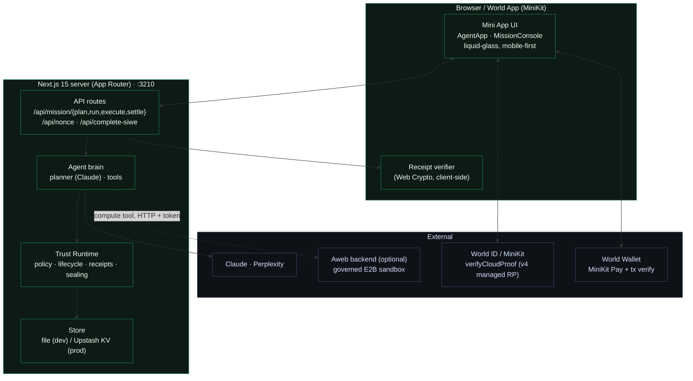
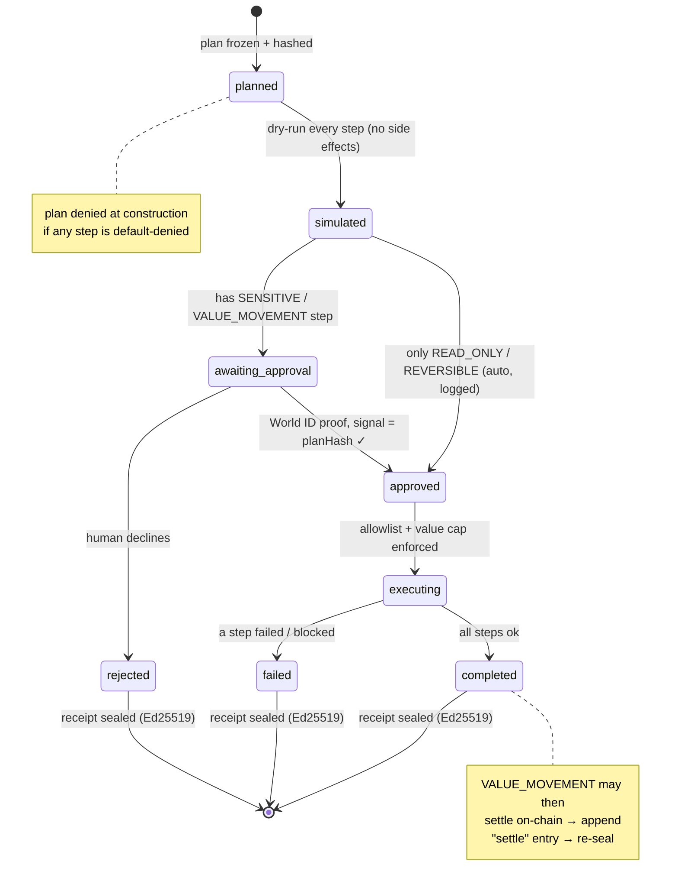
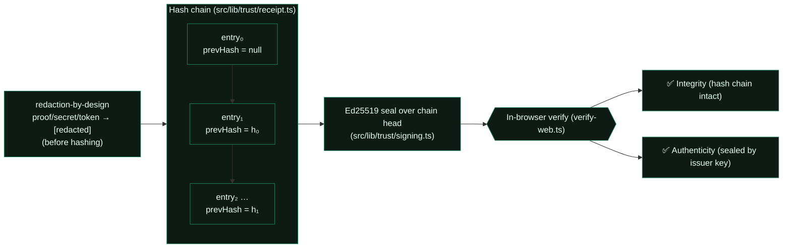
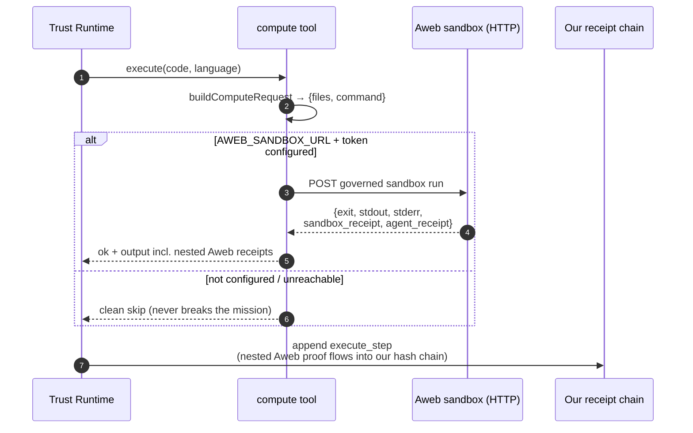

# Architecture — Aweb Agent for World

The technical companion to the [README](./README.md). The README is the *why* and the pitch; this is the *how* — modules, the lifecycle state machine, the proof model, and the optional Aweb backend integration.

> **Thesis:** World proves a *human* is behind the agent. Aweb proves the agent *behaved*. Identity says **who**; this layer records and proves **what the agent did** — and what it was blocked from doing.

---

## 0. Isolation contract (read first)

This app lives entirely under `web3/world-agent/`. The parent Aweb pnpm workspace only globs `packages/*`, `apps/*`, `services/*`, so **this app is invisible to the core Aweb build** — its own `package.json`, its own `node_modules` (npm, not pnpm), its own Vercel project. It never imports from or edits Aweb internals. The optional Aweb backend (the `compute` tool) is reached **only over HTTP, configured by env**, and degrades to a clean skip when absent. Trust never depends on it.

---

## 1. Containers

| Layer | Path | Role |
|---|---|---|
| Mini App shell | `src/app/`, `src/components/` | Next.js 15 + React 19 + `@worldcoin/minikit-js`. `MiniKit.isInstalled()` env detection; dev/mock mode outside World App. Liquid-glass UI; live streaming `MissionConsole`. |
| Login | `src/lib/world/` | **walletAuth (SIWE)** — `/api/nonce` → `MiniKit.walletAuth` → verify. Wallet + World username = the account (not World ID, per guidelines). |
| Proof of human + approval | `src/lib/world/verify.ts` | **World ID** via `verifyCloudProof` (World ID 4.0 managed RP). Plan-hash-bound approval for sensitive steps; one-human-one-agent via `verify-human`. |
| Trust Runtime | `src/lib/trust/` | Policy engine, lifecycle state machine, plan freeze + hashing, hash-chained + Ed25519-sealed receipts, anti-replay nullifier registry, in-browser verifier. |
| Agent brain | `src/lib/agent/` | Claude planner (NL → typed plan, zod-validated) + safe tools + the Aweb sandbox client. |
| Tools | `src/lib/tools/` | `research · draft · compute · send · pay` — each with an authoritative risk class. |
| Store | `src/lib/store/` | File-backed in dev; **Upstash KV** in prod (auto-switch via `WA_KV_*`), namespaced `wa:`. Missions, receipts, used-nullifier registry. |

---

## 2. The killer primitive — World-ID-bound approval

> A sensitive step cannot execute until a unique verified human produces a World ID proof whose `signal` is the SHA-256 hash of the exact, frozen mission plan.

- `action`: `approve-mission` · `signal`: `planHash` (SHA-256 of the canonical frozen plan)
- result: `nullifier_hash` (this unique human), `proof`, `merkle_root`, `verification_level` (orb/device)
- **Plan binding:** change the plan by one byte → approval is void (`signalHash !== approvalSignal()`).
- **Anti-replay:** the `(nullifier_hash, signal)` pair is recorded; an approval is single-use.
- **Sybil resistance:** the `verify-human` nullifier is the human's stable pseudonymous id → at most one agent per verified human.

Server verification uses the MiniKit SDK's `verifyCloudProof` (targets the correct v4 managed-RP endpoint). In dev/mock mode (no real App ID, or `WORLD_AGENT_DEV_MODE=true`) the proof is deterministically simulated so the full loop is testable in any browser.

---

## 3. The governed mission lifecycle

Every transition appends a hash-chained receipt entry. The core is **deterministic** — no `Date`/random inside the runtime; callers inject `now()` — which is what makes the receipts reproducible and the tests exact.

**Risk classes** (`src/lib/trust/policy.ts`, default-deny):

| Class | Decision | Used by |
|---|---|---|
| `READ_ONLY` | auto (logged) | `research` |
| `REVERSIBLE` | auto (logged) | `draft`, `compute` |
| `SENSITIVE` | needs World ID approval | `send` |
| `VALUE_MOVEMENT` | needs World ID approval **+ value cap + allowlist** | `pay` |

The risk class is **derived from the tool, not the model** — governance is never something the planner can talk its way around.

---

## 4. Proof model — receipts you verify yourself

- **Integrity:** `entryₙ.hash = SHA-256(canonical{seq,kind,at,summary,data,prevHash})`; altering any past entry breaks linkage.
- **Authenticity:** Ed25519 signature over the chain head; key from `TRUST_SIGNING_PRIVATE_KEY` (PKCS8 base64) in prod, a stable dev key otherwise. The public key travels with the receipt → verifiable offline.
- **Redaction:** the redactor strips `proof`, secrets, and tokens before hashing — the chain proves what happened without leaking it.
- Verification runs **client-side** (Web Crypto) on `/receipt/[id]` — no trust in the server.

---

## 5. Real, provable work — the `compute` tool + Aweb backend

The agent doesn't just govern intent; it does real computation, provably. The `compute` tool runs code in **Aweb's governed E2B sandbox** (no-network, secret-forbid, autoKill, budget-capped) and **nests the returned sandbox proof into our own receipt** → a triple-attested artifact.

Triple attestation: **verified human (World ID) → governed sandbox (Aweb E2B receipt, nested) → sealed chain (this app).** Because the tool degrades to a clean skip when the backend is absent, the open app always runs; the Aweb token is a pluggable superpower. See `src/lib/agent/aweb-sandbox.ts`.

> Note: Aweb's current `/api/aweb-code/preflight` is session-authenticated; a first-party API-key sandbox endpoint is the intended `AWEB_SANDBOX_URL` target for headless use.

---

## 6. World Wallet / x402 pay path

`pay` (`VALUE_MOVEMENT`) **authorizes only** — funds never move server-side. After World ID approval, settlement happens client-side via **MiniKit Pay**; `/api/mission/settle` then verifies the on-chain tx (`verifyWorldTransaction`), appends a hash-chained `settle` entry, and **re-seals** the chain. Value is capped per-step and cumulatively; the planner reconciles `valueUsd` ↔ `args.amountUsd` so the cap and the tool agree on one authoritative figure.

---

## 7. Deployment

- Live: **https://agent.aweblabs.ai** — isolated Vercel project (not the Aweb project).
- Persistence: **Upstash KV** in prod (`WA_KV_REST_URL` / `WA_KV_REST_TOKEN`), file-backed in dev.
- World ID 4.0: managed RP + production App ID; flip `WORLD_AGENT_DEV_MODE=false` for live proofs.
- Env reference: [`.env.local.example`](./.env.local.example). No secrets in the repo.

## 8. Tests

`npm test` (Node test runner via `tsx`) — **19 invariant tests** across governance (policy/lifecycle/anti-replay/chain integrity), Ed25519 sealing, and the sandbox compute tool (request mapping, HTTP client, graceful degrade, and an end-to-end mission that nests the Aweb proof and re-verifies the chain). `npm run typecheck` is strict and clean.
