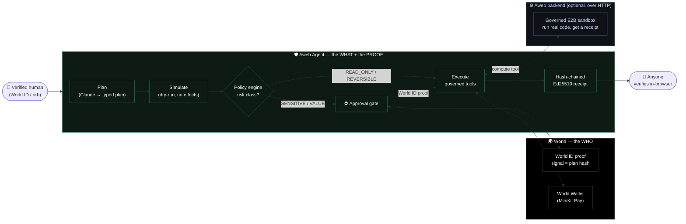
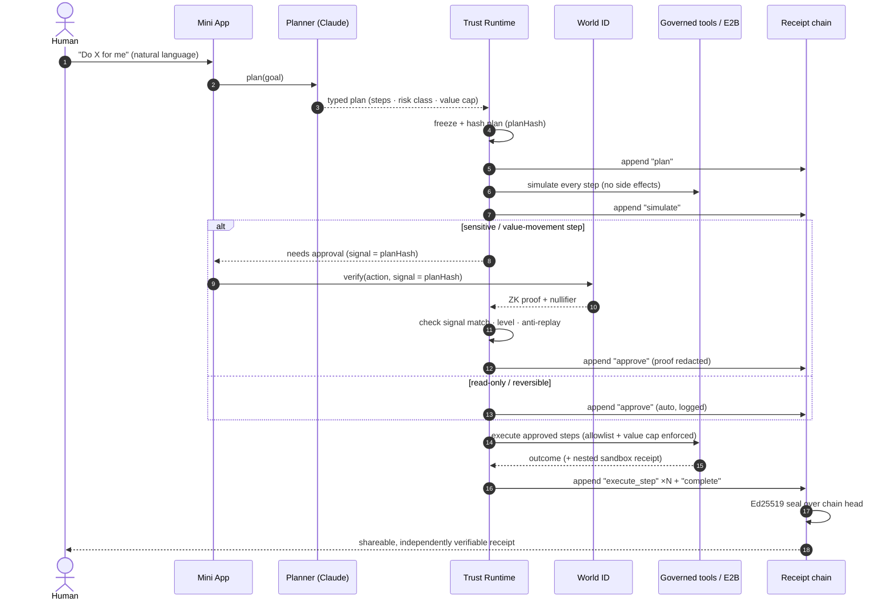
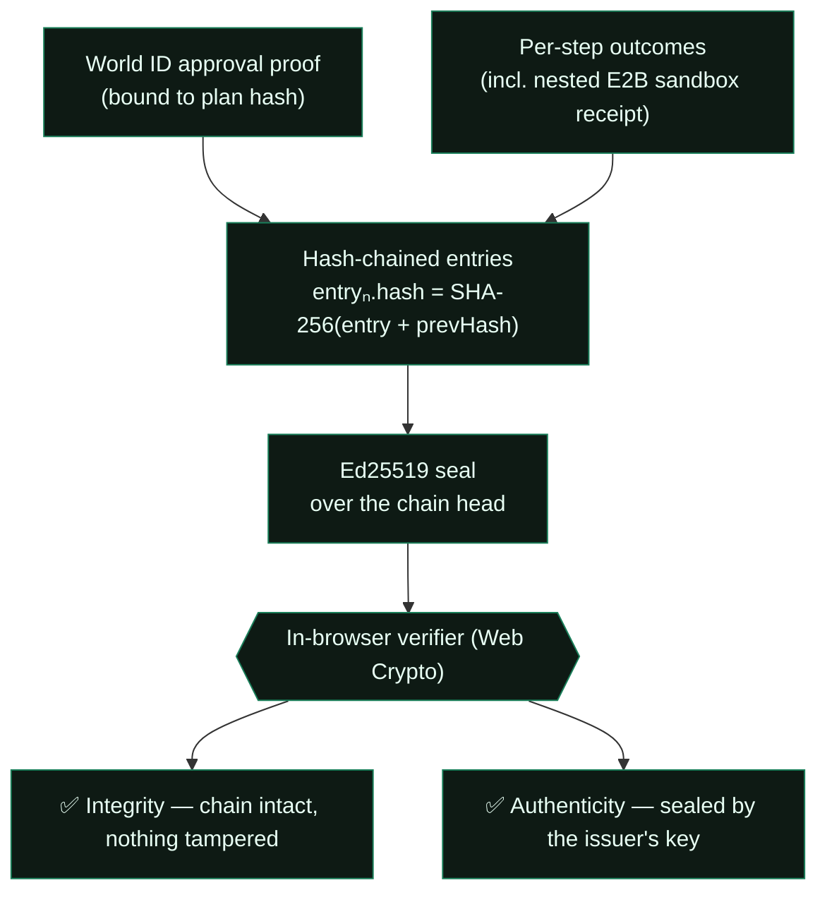

<div align="center">

# Aweb Agent for World

### The governance + proof layer for the verified-human agent economy.

**World proves a _human_ is behind the agent. Aweb proves the agent _behaved_.**

[](https://github.com/manfromnowhere143/aweb-world-agent/actions/workflows/ci.yml)
[](./LICENSE)
[](https://world.org/mini-apps)
[](https://www.typescriptlang.org/)
[](#proof-you-can-verify-yourself)

**[Live →](https://agent.aweblabs.ai)**  ·  **[How it works](#how-it-works)**  ·  **[Verify a receipt yourself](#proof-you-can-verify-yourself)**  ·  **[Architecture](./ARCHITECTURE.md)**

</div>

---

Every verified human gets a **governed personal agent**. It plans, dry-runs, asks _you_ to approve anything sensitive with **World ID** — where the approval is a zero-knowledge proof bound to the exact mission — executes across governed tools, and hands you a **hash-chained, Ed25519-sealed receipt** for everything it did _and everything it was blocked from doing_. You can verify that receipt **in your own browser, with zero trust in our server.**

This is the layer World's AgentKit deliberately leaves open: **governance, real-time human approval, an audit trail, accountability, non-repudiation.** Identity says _who_. This says _what the agent did, and proves it._

> Agents are moving from chat into real work — inboxes, payments, code, on-chain actions. Tool access alone isn't enough. You need an inspectable boundary: what was authorized, which human approved it, what ran, what was blocked, and what you can trust afterward. That boundary should be **open and auditable** — verifiability you can't read isn't verifiability. That's why this is here, under Apache-2.0.

---

## How it works



The agent is **sovereign**: identity (World) and verification (the receipt chain) stay local, so even an offline or untrusted backend can degrade _capability_ — never _trust_.

---

## The killer primitive — World-ID-bound approval

> **A sensitive step cannot execute until a unique verified human produces a World ID proof whose `signal` is the SHA-256 hash of the exact, frozen mission plan.**

- `action`: `approve-mission` · `signal`: `planHash` · result: `nullifier_hash`, `proof`, `merkle_root`, `verification_level`
- Change the plan by **one byte** → the approval is void (hash mismatch).
- **Single-use**: the `(nullifier_hash, signal)` pair is recorded — an approval can never be replayed.
- **One human, one agent**: the `verify-human` action's nullifier is the human's stable pseudonymous id → no bot armies.

This is non-repudiable accountability expressed in World's own primitive — exactly what AgentKit doesn't give you.

---

## The governed mission lifecycle



Risk classes: `READ_ONLY` (auto) · `REVERSIBLE` (auto, logged) · `SENSITIVE` (World ID approval) · `VALUE_MOVEMENT` (approval + value cap + allowlist). **Default-deny** anything unclassified or any tool not allow-listed.

---

## Proof you can verify yourself

Every mission ends in a receipt that is **doubly verifiable, with no trust in our server**:



- **Integrity** — each entry's hash covers the previous hash; altering any past entry breaks the chain.
- **Authenticity** — an Ed25519 signature over the chain head, verified in the browser against the embedded public key.
- **Triple attestation** when the agent runs code: _verified human (World ID) → governed sandbox (Aweb E2B receipt, nested) → sealed chain (this app)._
- **Redaction by design** — proofs, secrets, and tokens are stripped before hashing; the chain proves what happened without leaking it.

Open `/receipt/<id>` on any mission and watch both checks run client-side.

---

## Capabilities

| Tool | Risk class | What it does |
|---|---|---|
| `research` | `READ_ONLY` | Live, web-grounded research (Perplexity) with real citations recorded in the receipt. |
| `draft` | `REVERSIBLE` | Drafts a message/document from prior research — editable, no delivery. |
| `compute` | `REVERSIBLE` | Runs python/js/bash in a **governed, no-network, secret-forbidding sandbox** (Aweb E2B) and nests the sandbox proof into the receipt. Auto-runs; no external effects. |
| `send` | `SENSITIVE` | Delivers a message — **requires World ID approval.** |
| `pay` | `VALUE_MOVEMENT` | Authorizes a World Wallet payment within a value cap — **requires World ID approval**; settled client-side via MiniKit Pay, then the on-chain tx is verified and recorded. |

The agent's planner may only propose allow-listed tools, and **the risk class is derived from the tool, not the model** — governance is never something the model can talk its way around.

---

## Quickstart

```bash
git clone https://github.com/manfromnowhere143/aweb-world-agent
cd aweb-world-agent
npm install
cp .env.local.example .env.local      # set ANTHROPIC_API_KEY; dev mode is on by default
npm run dev                           # → http://localhost:3210
npm run typecheck                     # strict TS
npm test                              # governance + signing + sandbox invariant tests
```

In **dev mode** (default, or any browser outside World App) World ID and wallet are simulated, so the full governed loop is demoable end-to-end with no World setup. Add a real Developer Portal **App ID** and set `WORLD_AGENT_DEV_MODE=false` to go live inside World App.

---

## Project structure

```
src/
  lib/trust/      Trust Runtime — policy engine, lifecycle state machine,
                  hash-chained receipts, Ed25519 sealing, anti-replay registry,
                  in-browser verifier. (the governance core)
  lib/world/      walletAuth (SIWE) + World ID proof verification (plan-hash signal)
  lib/agent/      Claude planner (NL → typed plan) + safe tools + Aweb sandbox client
  lib/tools/      research · draft · compute · send · pay  (risk-classed)
  app/            Mini-App UI, API routes, and the verifiable /receipt/[id] page
test/             governance, signing, and sandbox invariant tests
```

---

## What's open here — and what isn't

**Open (this repo, Apache-2.0):** the full Mini App and the **Trust Runtime** — the governance state machine, hash-chained + Ed25519-sealed receipts, World-ID-bound approval, the in-browser verifier, and the risk-classed tool framework. The trust claims are auditable precisely because this code is readable.

**Not open:** Aweb's private backend that the `compute` tool optionally calls over HTTP (the E2B execution substrate, MCP provider warehouse, Maestro runtime) and all business internals. The app runs **fully without it** — the backend is a pluggable superpower, configured by env, that degrades to a clean skip when absent. No secrets, keys, or production data live in this repository.

---

## Security

- No credentials in the repo — everything is configured by environment variable; see [`.env.local.example`](./.env.local.example).
- The receipt redactor strips `proof`, secrets, and tokens before hashing.
- Found something? See [SECURITY.md](./SECURITY.md) for responsible disclosure.

## Contributing

Issues and PRs welcome — see [CONTRIBUTING.md](./CONTRIBUTING.md) and our [Code of Conduct](./CODE_OF_CONDUCT.md). CI runs typecheck + tests on every PR.

## License

[Apache-2.0](./LICENSE) © Aweb Labs. Permissive, with an explicit patent grant — built to be adopted.

---

<div align="center">

Built by **[Aweb Labs](https://aweblabs.ai)** — Mission Control Cloud for the agent workforce.

_Make something wonderful and put it out there._

</div>
